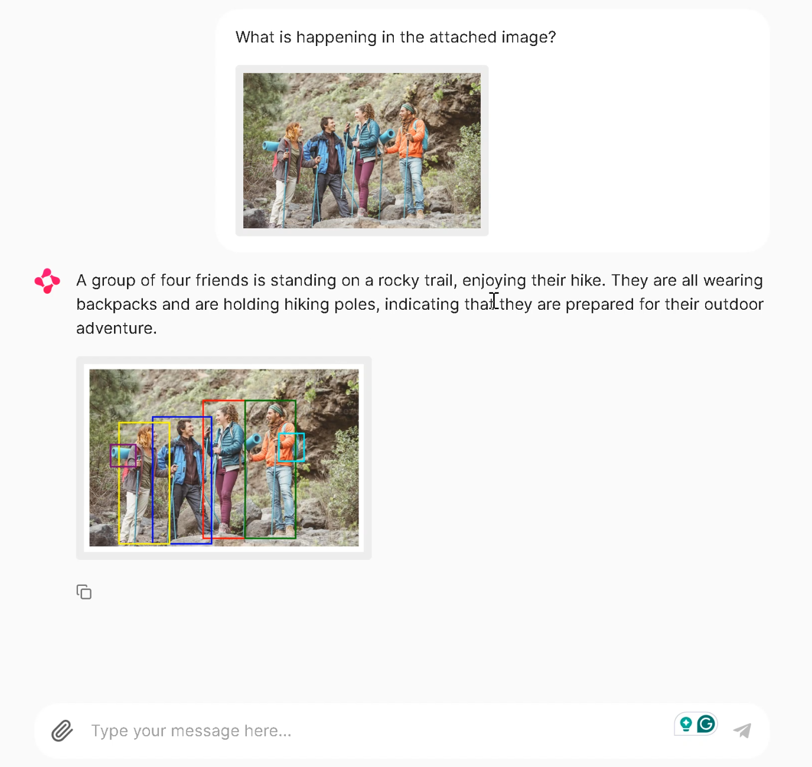

# Multi-Modal-chatbot-with-Nvidia-NIM and Chainlit

This project demonstrates image processing using the NVIDIA Inference API (`NIM_API`) to call Microsoft Kosmos 2 for object detection and uses Chainlit for message handling and visualization.

## Overview

This script allows you to upload an image via Chainlit, resize it if necessary, send it to the NVIDIA AI API (`invoke_url`), retrieve bounding boxes for detected objects, and visualize the results with matplotlib.

## Prerequisites

Before running the script, ensure you have the following set up:

- Python 3.x installed
- Required Python packages (`requests`, `base64`, `os`, `matplotlib`, `PIL`, `chainlit`, `dotenv`)
- NVIDIA API Key, which should be stored in a `.env` file
- Chainlit library for message handling (integration provided)

